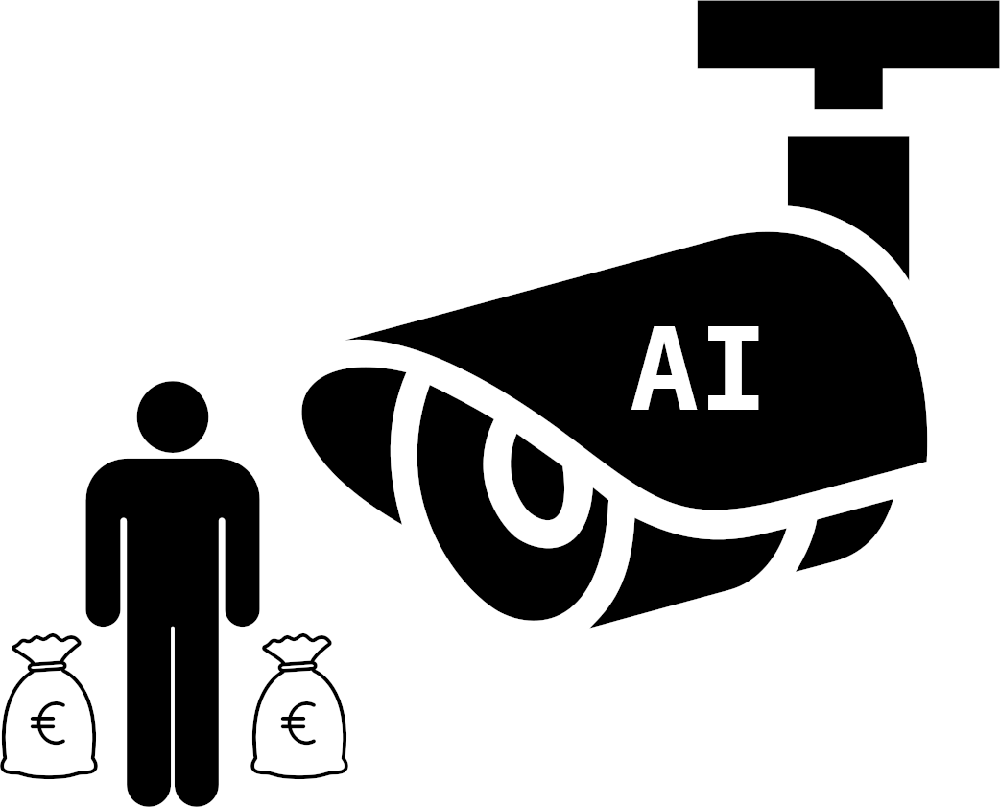

# AI Enabled Transparency of Governance and Power

This repository relates to a community effort of building tools for fair and just societies using machine intelligence tools.

Links to the community on other platforms:
- [Facebook group](https://www.facebook.com/groups/986349842236271)
- [Discord invite](https://discord.gg/9WESz4zAaH)
- [Repository](https://github.com/keskival/ai_enabled_transparency_of_governance_and_power)

Most of the content will be in the [Wiki](https://github.com/keskival/ai_enabled_transparency_of_governance_and_power/wiki).

## Motivation

Why do we want AI tools to enable transparency in power instead of enabling cementing power structures and enabling autocrats?

If we let things go on on the organic path of least resistance, these technologies will not empower the people into a prosperous future, but instead they will be used to pacify and restrict the power of the people and all avenues people might still have to make any social change.

The powerful telescopes of AI are generally pointed towards the masses allowing scaling of mass surveillance, where fewer and fewer people are needed to keep the rest in check. This will be the death of liberal democracy and citizen rights. Privacy of the citizens is eroded to nothingness while the privacy of the people in power is defended by tax havens and confidential trust arrangements.

This fundamental asymmetry needs to be fixed. Who will fix it if not us? What we cannot do, we must find others who can. Where we lack access to make a change, we find people who have that access.

Let's do this a small step at a time and produce substantial, irrevocable progress while doing it. Most importantly, let's have fun and create new connections.

## How to Contribute

Join the channels/groups linked, and ask for permissions to contribute to this project on GitHub. You are also free to submit pull requests, but the main activity will happen in the [Wiki](https://github.com/keskival/ai_enabled_transparency_of_governance_and_power/wiki).
